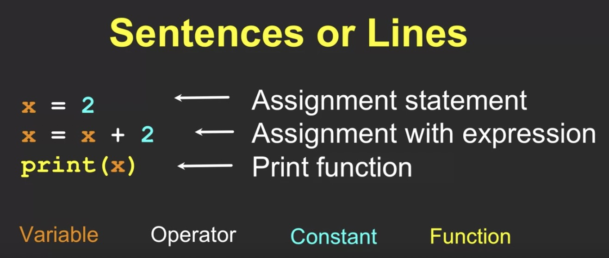

# Why We Program

## Why Program
Program is a set of instructure
### Programmers Role
- As a programmer we need to serve users
- Our job as programmer is to intermediate between the hardware and the user.

### Why be a programmer?
- To get some task done!
- To produce something for others to use

## Hardware Overview
Set of CPU, Main Memory, IO Devices, Secondary Memory, etc
The devices getting smaller and smaller these days

## Python as a Language
- Guido van Rossum invented this Python language
- We call our self **Pythonistas**
- Install Python
  - Download here https://www.python.org/downloads/

## Python Vocabulary

### Reserved Words
  A words that cannot be use as variable names/identifiers

### Sentences or Lines

### Interactive vs Script
*Interactive*

Type directly to Python one line at a time and it responds

*Script*

Enter a sequence of statements into a file and tell Python to execute the statements in the file.

### Program Flow
- Run in **sequence**
- Some steps are **conditional**
- Some step **repeated**
- Sometimes we use set of steps over and over (**function**)

